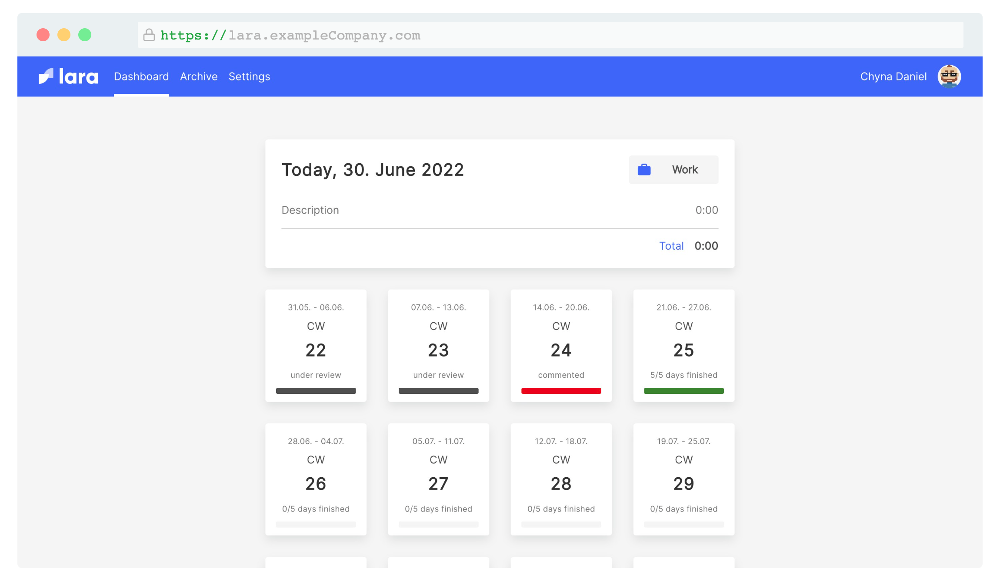

# Lara

Lara is a tool for writing your "Berichtsheft" digitally. In Germany all trainees have to write these kind of weekly reports. This tool gives you the ability to write and share reports with your trainer, get them approved, commented and signed with a digital signature. Lara also allows you to export all your archived reports in one PDF file ready to be handed over to your "Handelskammer". Furthermore Lara sends E-Mail notifications to inform trainees and trainers about outstanding actions and the status change of reports.



### Prerequisites

In order to run the project we need `node=14` installed.

## 🛠 Under the hood

We're using the following dependencies for lara:

1. `yarn` as dependency manager
2. `react` as view library
3. `styled-components` for styling
4. `jest` & `playwright` for testing
5. `apollo-react` for fetching GraphQL apis
6. `webpack` as module bundler for builds
7. `webpack-dev-server` for a development server with HMR
8. `serverless` for deployment to AWS
9. `dynamoDB` as a database

## 🚀 Getting started and local development

In order to use the frontend, you need an instance of the backend running on port `:3000`.

From the root of the project call:

1. `yarn`
2. `yarn db:install`
3. `yarn compile:watch`
4. `yarn start`

`compile:watch` starts a file watcher and `start` starts a dev server which serves the frontend on port `:8080`

### Linting

We're linting our files with ESLint in order to achieving a consistent codestyle and preventing simple errors. JavaScript files are linted by ESLint with `@typescript-eslint/recommended` config.

```bash
# Lint source files
yarn lint:verify

# Fixes minor issues e.g indentation
yarn lint
```

### Writing tests

To write a new test with `jest`, add a file to the `packages/frontend/src/test` directory with a name like `my-new-test.test.ts`. Jest will only recognize tests, which are defined in a file with the filename ending on `.test.ts` or `.test.tsx`.

To write a new test with `playwright`, add a file to the `packages/e2e/tests` directory with a name like `my-new-test.spec.ts`. Playwright will only recognize tests, wich are defined in a file with the filename ending on `.spec.ts`.

### Developing FE Components

There are two packages for developing components in the frontend. `packages/frontend` contains the logical structure of components and pages without styling. `packages/components` contains all stylings for the components.

### Using GraphQL (FE)

We use `grapql-codegen` to generate exact typings from the queries and mutations we write. To add a new query/mutation, do the following:

1. Create a `.gql` file in the `mutations` or `queries` folder inside the directory `packages/frontend/src/graphql`.
2. Give your query/mutation a name. This step is really important as `graphql-codegen` will use this name to create a higher order component for you. Your query should look something like this: `query ArchivePageData { ... }`.
3. Run `yarn generate:types`.
4. Import your shiny new graphql higher order component from the graphql directory.

### Using GraphQL (BE & API)

There are two directories for developing requests in the backend. `packages/api` contains all typings for GraphQL queries and mutations. Extend the GraphQL schema in `packages/api/schema.gql`. In order to keep the local types synchronized, we generate types automatically with `graphql-codegen`. Run `yarn generate:types` to generate the new corresponding typedefinitions. In `packages/api/src` add your typescript types to be used in the backend.

In `packages/backend/src/resolvers` the resolvers for the GraphQL queries and mutations are written. In addition the database operations themselfs are defined in `packages/backend/src/repositories`.

### Developing E-Mail notifications

E-Mails are developed inside `packages/email`. Run `yarn debug` inside this directory to inspect the templates of the mails.

### Developing PDF printing

PDF printing is developed inside `packages/print`. Run `yarn debug` inside this directory to inspect the template of the generated report PDF.

## 🚧 Project setup

### Deployment Environment variables

- MICROSOFT_TENANT_ID
  - String containing ?
- PROD_MICROSOFT_CLIENT_ID
  - String containing ?
- AWS_ACCESS_KEY_ID
  - String containing AWS IAM User ID used for deployment
- AWS_SECRET_ACCESS_KEY
  - String containing AWS IAM User Secret Key used for deployment 

- URL_ORIGIN
  - String containing the origin of the environments. Used in emails. E.g.: lara.exampleCompany
- COMPANY_ABBREVIATION
  - Shortform of your companies name to create s3-buckets
- OLD_COMPANY_NAME
- NEW_COMPANY_NAME
  - Add these two, if you have mails mapped from an old name to a new name. If not provided, no changes will be applied to usage of email addresses.
- AVATAR_URL
  - String containing the URL to avatars. In the end a mailhash from the user is added. If not provided random avatars from dicebear are used. 
- SES_EMAIL
  - String containing the email address of the bot sending notifications e.g.: lara-bot@exampleCompany.com
- SES_REGION
  - String of aws region (probably eu-west-1)
- SUPPORT_MAIL
  - String containing the email address users can contact in case of problems e.g.: lara@exampleCompany.com
- PRODUCTION_FE_URL
  - String containing the URL to the production frontend e.g.: https://lara.exampleCompany.com/
- PRODUCTION_BE_URL
  - String containing the URL to the production backend e.g.: https://api.lara.exampleCompany.com/
- LARA_SECRET
  - Secret used in creating oauth secrets

### All Environment variables

The following variables should be added to your cloned version of Lara.

- MICROSOFT_TENANT_ID
  - String containing ?
- PROD_MICROSOFT_CLIENT_ID
  - String containing ?
- STAGING_MICROSOFT_CLIENT_ID
  - String containing

- AWS_ACCESS_KEY_ID
  - String containing AWS IAM User ID used for deployment
- AWS_SECRET_ACCESS_KEY
  - String containing AWS IAM User Secret Key used for deployment 
- AUTH_HEADER
  - String containing the value for the authorization header
- URL_ORIGIN
  - String containing the origin of the environments. Used in emails. E.g.: lara.exampleCompany
- Debug
  - ? 
- COMPANY_ABBREVIATION
  - Shortform of your companies name to create s3-buckets
- MICROSOFT_CLIENT_ID
- MICROSOFT_TENANT_ID
  - Microsoft keys to use for login
- LARA_SECRET
  - Secret used in creating oauth secrets
- OLD_COMPANY_NAME
- NEW_COMPANY_NAME
  - Add these two, if you have mails mapped from an old name to a new name. If not provided, no changes will be applied to usage of email addresses.
- AVATAR_URL
  - String containing the URL to avatars. In the end a mailhash from the user is added. If not provided random avatars from dicebear are used. 
- SES_EMAIL
  - String containing the email address of the bot sending notifications e.g.: lara-bot@exampleCompany.com
- SES_REGION
  - String of aws region (probably eu-west-1)
- SUPPORT_MAIL
  - String containing the email address users can contact in case of problems e.g.: lara@exampleCompany.com
- FRONTEND_URL
  - String containing frontend development url
- BACKEND_URL
  - String containing backend development url
- ENABLE_FRONTEND_TUNNEL 
  - Boolean
- ENABLE_BACKEND_TUNNEL
  - Boolean
- ALEXA_SKILL_ID
  - Not required
- ALEXA_AMAZON_CLIENT_ID
  - Not required
- ALEXA_AMAZON_CLIENT_SECRET
  - Not required


- STAGING_BE_URL
  - String containing the URL to the staging backend e.g.: https://staging.api.lara.exampleCompany.com/
- STAGING_FE_URL
  - String containing the URL to the staging frontend e.g.: https://staging.lara.exampleCompany.com/
- PRODUCTION_BE_URL
  - String containing the URL to the production backend e.g.: https://api.lara.exampleCompany.com/
- PRODUCTION_FE_URL
  - String containing the URL to the production frontend e.g.: https://lara.exampleCompany.com/

- TEST_TRAINEE_ID
- TEST_TRAINER_ID
  - ID of testusers on the staging environment for e2e tests. If not provided e2e tests are skipped.

- LARA_SECRET
  - Secret used in creating oauth secrets
- STAGE
  - String containing stage (probably: dev/prod)

### NEW AWS SETUP

#### IAM User

- Create a IAM deployment user and give him admin rights and save the credentials!

#### Deployment

- Fill out the .env file partially 
- (Install dependencies)
- Run `yarn build`
- Run `serverless deploy` command 
- Copy Cloudfront distribution urls or custom domains into .env 


### AWS Setup

#### Login

- Create a login with [Google Application](https://developers.google.com/identity/sign-in/web/sign-in)
  - After the deployment the frontend URL must be added there
- `GOOGLE_API_KEY` and `GOOGLE_CLIENT_ID` should be entered (in .env for local deployment)

#### Bucket creation

- Create a public s3 bucket with the name `[COMPANY_ABBREVIATION]-lara-frontend-[stage]`
  - `[COMPANY_ABBREVIATION]` is the shortform of your companies name and `[stage]` is either `staging` or `production`
- Enable the hosting of static websites on this bucket
  - The `indexdocument` AND the `errordocument` are both the `index.html`
- Configure the bucket further like described in this [AWS guide](https://docs.aws.amazon.com/AmazonS3/latest/userguide/HostingWebsiteOnS3Setup.html)

#### IAM user

- Create a IAM deployment user and give him admin rights

#### Deployment

- If the URL's aren't know yet:
  - For the first deployment set dummy-values for `FRONTEND_URL` and `BACKEND_URL`
- For the local deployment:
  - fill out the .env
  - run `yarn build`
  - run `serverless s3sync —bucket [COMPANY_ABBREVIATION]-lara-frontend-[stage]`
  - run `serverless deploy —stage [stage]`
- For remote deployment:
  - set all GitHub Actions environment variables
  - for a staging deployment create a push on main
  - for a production deployment create a tag

#### Set the correct url's

- Backend and frontend url:
  - for the frontend the bucket url can be used
    - for HTTPs a cloudfront distribution or a CNAME record can be created, which point to the bucket url
  - for the backend the API gateway url can be used
    - a cloudfront distribution or a CNAME record can be created here too, which point to the API gateway url
- Redeploy if necessary with the correct url's

#### DB setup

- In AWS DynamoDB:
  - add a admin user to your user table with:

```json
{
  "id": "12345exampleID",
  "companyId": "exampleCompanyID",
  "createdAt": "2021-11-23T11:52:01.481Z",
  "email": "lara.admin@exampleCompany.de",
  "firstName": "Lara",
  "lastName": "Admin",
  "notification": true,
  "type": "Admin"
}
```

- add your company or subcompanies in the company table with:

```json
{
  "id": "exampleCompanyID",
  "name": "ExampleCompany"
}
```

## 🌳 New Branch

Branchname should shortly describe the changes in your branch.

## 💬 Commitlint

We are using [commitlint](https://github.com/conventional-changelog/commitlint#what-is-commitlint) for consistent commit messages. Example: fix/feat/refactor: -content of commit-

## 🏗 Build process

You can run the buildprocess by executing `yarn build`. The following environments are currently available:

- development: For local development purpose
- staging: For http://staging.lara.exampleCompany.com
- production: For http://lara.exampleCompany.com

You can add new environments by extending the `serverless.yml` and also adjusting the deployment in the `.github/workflows` GitHub Actions.

## 👛 Changelog

The changelog is located in the `changelog.md`. Please add an entry for every change to the next undeployed version. The change should contain the ticket number if there is any.

```md
# Changelog

...

## 1.0.1 (Semantic version)

- Deployed to production: TODO (Date of deployment / TODO if not deployed)
- Changes:
  - Introduction of changelog ...
```

## ⚖️ LICENSE

MIT © [Accenture Song](LICENSE)
